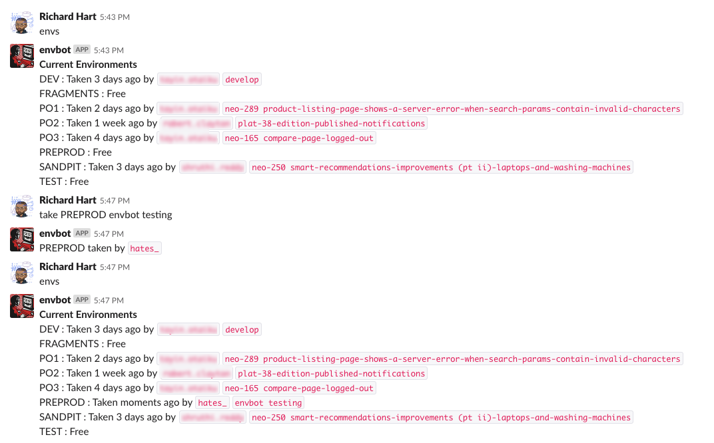

# Envbot
> Slackbot to track environment usage by developers

For teams that have access to a small amount of environments for testing code it can be difficult to keep track of
who is using what environment. This bot allows for a simple means of allowing developers to mark an environment
as in use.

